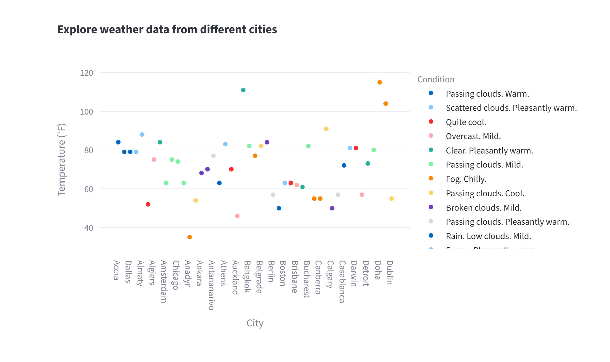
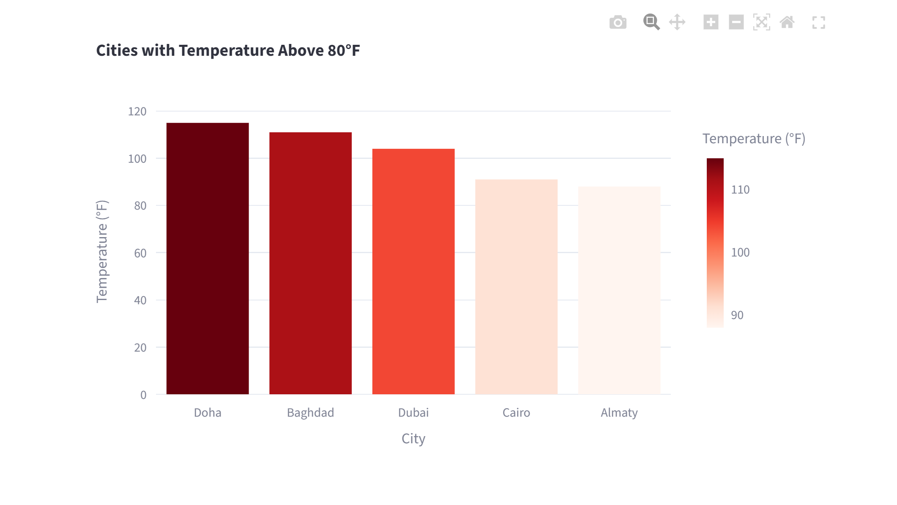

# Weather Data Dashboard
This project is a weather data dashboard built using Python, Streamlit, and SQLite.
It displays weather information for different cities using data that was scraped, cleaned, and stored in a database.

## Tools Used

- Python  
- Pandas  
- SQLite  
- Streamlit  
- Plotly Express 

## Data Source
The data was collected using a web scraping process from a weather website, then cleaned and stored in a SQLite database.

## Visualization
Streamlit and Plotly were used to build interactive charts including:
- Bar chart for temperature comparison across cities
- Scatter plot with hover details (city, temperature, weather condition)
- Highlighted view of hottest cities

## Dashboard Screenshot


 
## Setup Instructions
To run this project locally:

1. Install the required packages by running the following command in your terminal:
   ```bash
   pip install -r requirements.txt
   ```

2. Run the Streamlit application:
   ```bash
   streamlit run streamlit_app.py
   ```